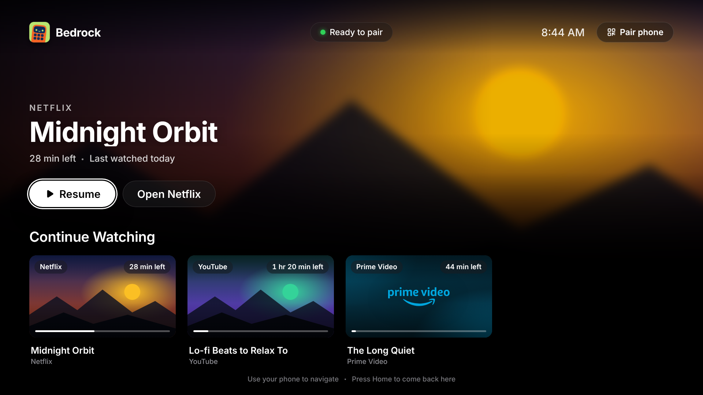
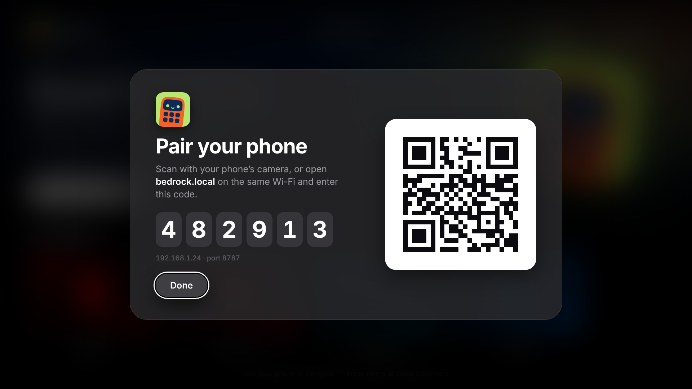
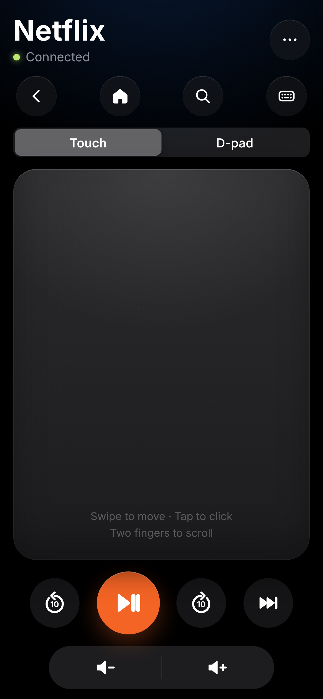
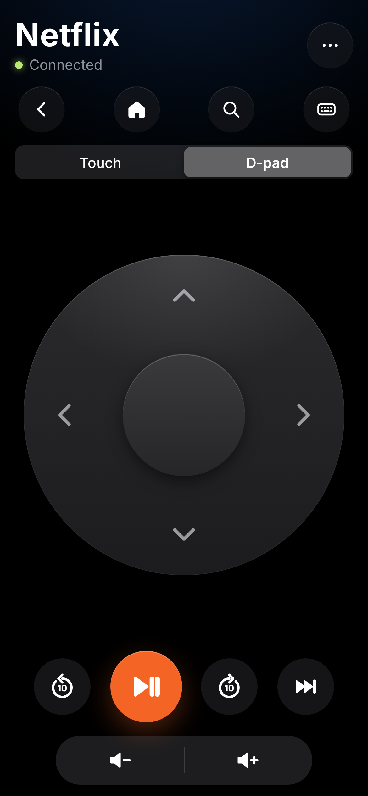

<p align="center">
  
</p>

<h1 align="center">Bedrock</h1>
<p align="center"><strong>Your laptop, from bed.</strong><br/>
Netflix, YouTube, Prime Video and Hotstar on a big-screen home, with your phone as the remote.</p>

<p align="center">
  
</p>

## What it is

Bedrock turns the laptop at the foot of your bed into a TV. It opens full-screen into a 10-foot home for your
streaming apps, and your phone becomes the remote. You don't install anything on the phone. Scan the QR code on
screen, enter the 6-digit code once, and from then on you can play, pause, skip, change the volume, type in search
and go home without getting up.

| On your laptop | On your phone |
|---|---|
|  |   |

- **Continue Watching** picks up where you left off, with time left and progress.
- **Siri Remote–style controls:** a touch clickpad or a D-pad, a big play/pause button, ±10 s, and a volume rocker within thumb reach.
- **Keyboard and search** from your phone for logins and finding shows.
- **Instant feedback:** every press shows a small confirmation on the TV and on the phone.
- **Private by default:** it runs only on your Wi-Fi, and phones must pair with a code.
- **Stays signed in:** each app keeps its own session, and DRM playback uses Widevine.

The full screenshot set is in [`docs/screenshots/`](docs/screenshots/). The design rationale is in
[`docs/design/bedrock-design-system.md`](docs/design/bedrock-design-system.md), which follows Apple's tvOS and
iOS Human Interface Guidelines. The competitive research is in
[`docs/research/arvio-competitive-analysis.md`](docs/research/arvio-competitive-analysis.md).

## Project layout

```
packages/
  shared/   # Remote commands, MediaSource contract, WS protocol, feedback copy (zero runtime deps)
  desktop/  # Electron shell: TV launcher UI, source host, WS/mDNS remote server, SQLite history
  remote/   # Phone remote PWA (served by the desktop app over the LAN)
static/     # Brand assets: mascot logo and app icons
e2e/        # Playwright end-to-end + screenshot suite (standalone npm project)
docs/       # PRD, architecture, design system, research, screenshots, release notes
```

**Architecture rule:** adding a streaming source only touches `packages/desktop/src/main/sources/`.

## Develop

Requirements: Node.js ≥ 20 and [pnpm](https://pnpm.io/) 9 (`corepack enable && corepack prepare pnpm@9.15.0 --activate`).

```bash
pnpm install
pnpm --filter @bedrock/shared build
pnpm dev            # run the desktop app
pnpm dev:remote     # run the phone remote on :5174 against a running desktop app
```

| Command | What it does |
|---|---|
| `pnpm typecheck` | Typecheck all packages |
| `pnpm test` | Unit tests (vitest) for desktop + remote |
| `pnpm build` | Build all packages |
| `cd e2e && npm ci && npx playwright test` | End-to-end UI tests; refreshes `docs/screenshots/` |

See [`docs/architecture.md`](docs/architecture.md), [`docs/PRD.md`](docs/PRD.md), [`docs/widevine-vmp.md`](docs/widevine-vmp.md)
and [`docs/windows-release.md`](docs/windows-release.md). Historical prototype trackers are in
[`docs/progress_tracking/`](docs/progress_tracking/).

Branches follow [Conventional Branch](https://conventionalbranch.org): see
[`.claude/skills/conventional-branch/SKILL.md`](.claude/skills/conventional-branch/SKILL.md).
